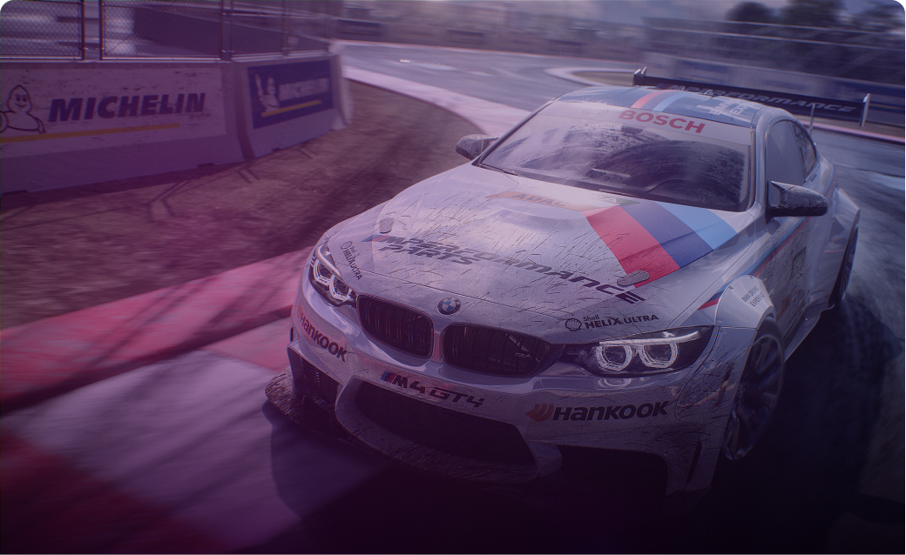

# SuperCar

## 📝 Table of Contents
- [About](#about)
- [Getting Started](#start)
- [How to play](#play)
- [Built Using](#build)
- [Demo and Screenshots](#demo)
### 📙About<a name = "about"></a>
🚗 SuperCar is a 3D infinite survival game in which you trying to avoid obstacles while collecting full icons to keep the journey going which is coded using OpenGL
## 🏁Getting Started <a name = "start"></a>
```
Install Visual Studio Code.
```
```
Open the folder in Visual Studio Code.
```
```
Build the project.
```
```
Open a terminal (Terminal > New Terminal).
```
```
Run this Command  .\bin\GAME_APPLICATION.exe -c="config\test_app.jsonc"
```
## 🎮How to play<a name = "play"></a>
- We have two modes **First** mode try to avoid obstacles you have a limitation of 4 guards. **second** mode try to achieve max score by avoiding obstacles you have unlimited guards.
- Press **1 or 2** to select Mode.
- Use **A** to move left.
- Use **D** to move right.
- Use **R** to Restart game.
- Use **Q** to Quit game.
## 💻Built Using<a name = "build"></a>
- OpenGL
## 🎥 Demo<a name = "demo"></a>
<div name = "demo" align="center" width=1189>

</div>

## 📷Screenshots


## contributors 
[](https://github.com/yousefelmahdy)
[](https://github.com/BishoyAtef)
[](https://github.com/YousefElshabrawy)

